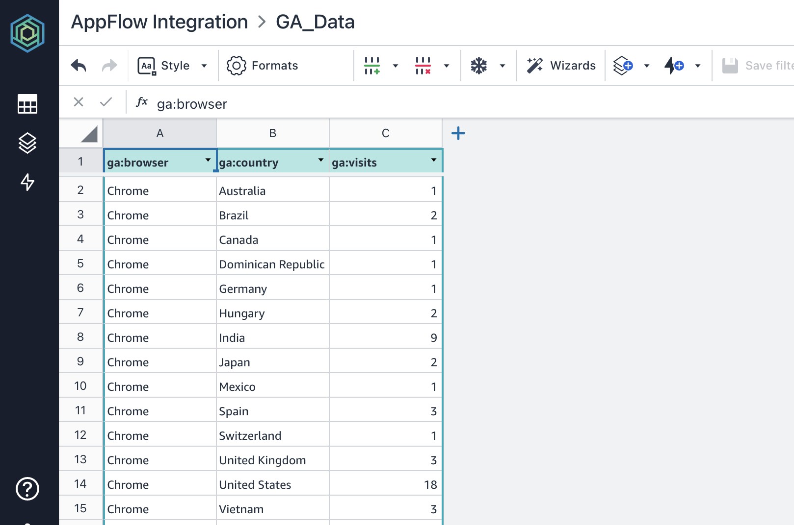
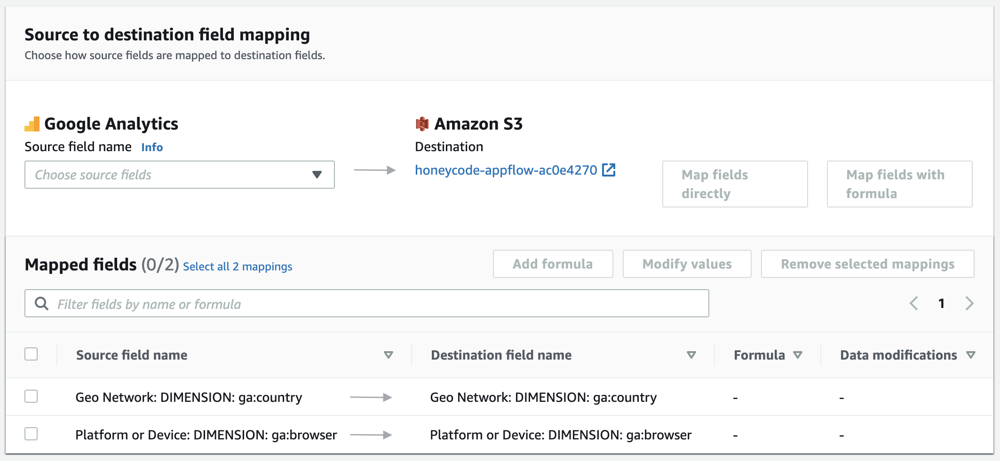

# Honeycode AppFlow Integration

# UPDATE December 2020: Honeycode now has [native AppFlow integration](https://aws.amazon.com/about-aws/whats-new/2020/12/amazon-appflow-provides-amazon-honeycode-connectivity-cloud-applications/)

> Looking to export data from Honeycode? Check out [honeycode-export](https://github.com/iann0036/honeycode-export).

Add Honeycode as a destination from AppFlow.

## Installation

> Currently, the only possible region is `us-west-2`.

First, create your Honeycode account and create an ADMIN user and record credentials (email address / password).

Then click the above link to deploy the stack to your environment. If you prefer, you can also manually upsert the [template.yml](https://github.com/iann0036/honeycode-appflow-integration/blob/master/template.yml) stack from source.

You will need to provide the Workbook ID and Sheet ID which can be found in the URL bar, or via the [modal](https://docs.aws.amazon.com/honeycode/latest/UserGuide/arns-and-ids.html).

Once launched, the CloudFormation stack will output the name of an S3 bucket it has created. You can now create an AppFlow flow that points from a supported source, with direct mappings, to this destination bucket and the Honeycode table will be populated each time the flow is run.

The following AppFlow sources are currently supported:

* Google Analytics
* Slack
